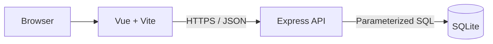
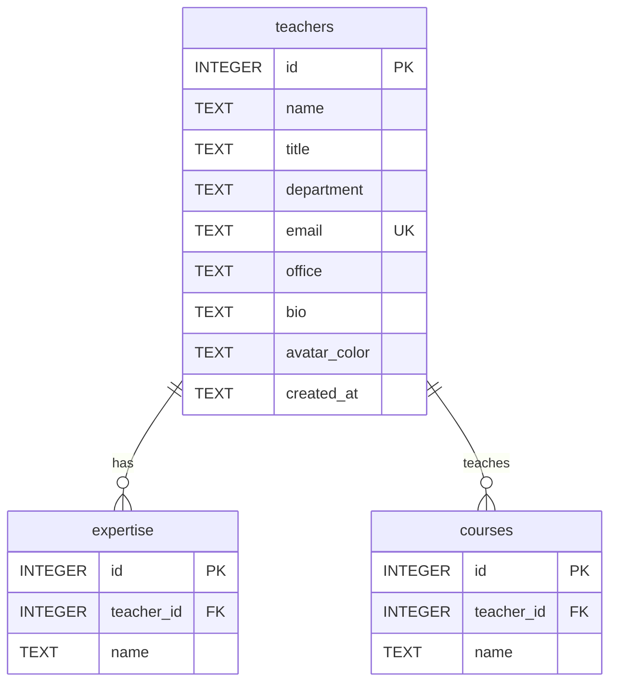

# Campus Expert Finder

> 校園教師專長搜尋平台——從研究興趣出發，找到適合請益的教師

[網站部署](https://purple-hill-0ba474d00.7.azurestaticapps.net)

Campus Expert Finder 是一個前後端分離的教師資訊搜尋網站。使用者可以透過教師姓名、職稱、系所、研究專長或授課課程搜尋教師，再搭配系所與專長條件縮小結果，查看教師的完整資料。

> [!IMPORTANT]
> 本專案中的教師姓名、信箱、研究室、簡介、專長與課程皆為 AI 生成的虛構資料，不代表任何真實人物、學校或系所。

## 功能

- 跨欄位關鍵字搜尋：姓名、職稱、系所、研究專長與授課課程。
- 系所與研究專長篩選。
- 熱門研究領域快捷入口。
- 搜尋條件同步至 URL，重新整理或分享連結後仍能保留條件。
- 教師卡片與教師詳細資料頁。
- Loading、Empty、Error、404 與重新載入狀態。
- 響應式設計，支援桌面、平板與手機。
- 全站清楚標示模擬資料，避免與真實教師資訊混淆。

## 系統架構

| 層級 | 技術 | 用途 |
| --- | --- | --- |
| 前端 | Vue 3、Vite、Vue Router | 頁面、元件、路由與搜尋狀態 |
| 樣式 | HTML、原生 CSS | 響應式版面與操作回饋 |
| 後端 | Node.js、Express | JSON API、參數驗證、錯誤處理與 CORS |
| 資料庫 | SQLite、better-sqlite3 | 教師、專長、課程與搜尋查詢 |
| 部署 | Azure Static Web Apps、App Service | Vue 前端與 Express API |



## 資料庫

資料庫包含 24 位模擬教師、72 筆研究專長與 48 門課程。教師與專長、課程皆為一對多關係。



- 外鍵使用 `ON DELETE CASCADE` 維持關聯完整性。
- Seed 透過 transaction 重建一致的資料，不會累積重複紀錄。
- 搜尋使用 prepared statement 與 `EXISTS` 子查詢，避免 SQL injection 及重複教師結果。

## API

本機 Base URL：`http://localhost:3000/api`

正式環境 Base URL：

```text
https://campus-expert-finder-api-g7aud9ercnfbcpa5.eastasia-01.azurewebsites.net/api
```

| Method | Endpoint | 說明 |
| --- | --- | --- |
| `GET` | `/health` | 檢查 API 與資料庫狀態 |
| `GET` | `/teachers` | 取得教師列表或搜尋結果 |
| `GET` | `/teachers/:id` | 取得單一教師完整資料 |
| `GET` | `/meta/departments` | 取得系所選項與教師數量 |
| `GET` | `/meta/expertise` | 取得專長選項與教師數量 |

`GET /teachers` 支援以下 query parameters：

| 參數 | 說明 | 範例 |
| --- | --- | --- |
| `q` | 搜尋姓名、職稱、系所、專長與課程 | `人工智慧` |
| `department` | 精確篩選系所 | `資訊工程學系` |
| `expertise` | 精確篩選研究專長 | `機器學習` |

範例：

```http
GET /api/teachers?q=人工智慧&department=資訊工程學系
```

成功回應以 `data` 為主要內容，列表回應另包含 `meta.count` 與實際套用的篩選條件。錯誤回應使用統一格式：

```json
{
  "error": {
    "code": "INVALID_PARAMETER",
    "message": "id 必須是正整數"
  }
}
```

## 專案結構

```text
campus-expert-finder/
├── client/                      # Vue + Vite 前端
│   ├── public/                  # Static Web Apps 路由設定
│   └── src/
│       ├── components/          # 共用與展示元件
│       ├── pages/               # 首頁、列表、詳細頁與 404
│       ├── router/              # Vue Router
│       └── services/            # API service
├── server/                      # Express API
│   └── src/
│       ├── db/                  # Schema、seed、connection、queries
│       ├── routes/              # Teachers 與 meta routes
│       ├── utils/               # HTTP error helpers
│       ├── app.js
│       └── server.js
└── .github/workflows/           # Azure 自動部署流程
```

## 本機執行

### 環境需求

- Node.js 22 LTS
- npm
- Git

### 1. 取得專案

```bash
git clone https://github.com/fizz123123/campus-expert-finder.git
cd campus-expert-finder
```

### 2. 啟動後端

```bash
cd server
npm ci
npm run db:seed
npm start
```

後端預設啟動於 `http://localhost:3000`。可開啟 `http://localhost:3000/api/health` 確認 API 與資料庫狀態。

### 3. 啟動前端

另開一個終端機：

```bash
cd client
npm ci
npm run dev
```

前端預設啟動於 `http://localhost:5173`。

## 環境變數

專案提供合理預設值，不建立 `.env` 也能在本機執行。需要自訂時，可依照範例檔建立 `.env`。

Client：

```dotenv
VITE_API_BASE_URL=http://localhost:3000/api
```

Server：

```dotenv
PORT=3000
CLIENT_ORIGIN=http://localhost:5173
DB_FILE=./data/campus-expert-finder.sqlite
```

`VITE_API_BASE_URL` 是 Vite 的 build-time 變數，修改後需要重新建置前端。

## 驗證

後端：

```bash
cd server
npm run db:verify
npm run api:check
npm run azure:check
```

前端：

```bash
cd client
npm run lint
npm run build
```

## 部署

- Vue 前端部署於 Azure Static Web Apps。
- Express API 部署於 Azure App Service。
- GitHub Actions 在 `main` 更新時自動建置與部署。
- Azure App Service 使用 instance-local SQLite；執行個體重新啟動後，應用程式會自動建立 schema 並載入固定 seed 資料。

目前資料為唯讀展示資料。若未來需要保存使用者新增或修改的內容，應將 SQLite 改為 Azure SQL 等持久化受管資料庫。

## 參考專案

本專案參考 [Learnmore-smart/RateMinistere](https://github.com/Learnmore-smart/RateMinistere) 的教師搜尋流程、教師資料卡片與詳細 profile 資訊層級，並將概念轉化為研究專長探索。

本專案沒有複製原專案程式碼、樣式或圖片，也沒有沿用其 Next.js、React 與 MongoDB 技術架構；實作使用 Vue、Express 與 SQLite。
